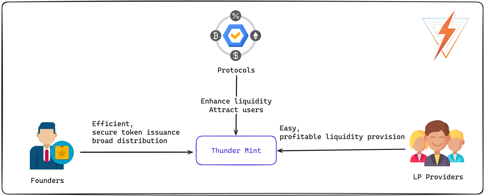

# Thunder Mint

<a href="https://t.me/Thunder_Finance" target="_blank"></a>


Welcome to Thunder Mint, the revolutionary platform that empowers project creators to launch their liquidity mining pools with just a click. By offering a seamless way to reward users with platform tokens for their liquidity provider (LP) tokens, we're setting a new standard in enhancing DEX liquidity through our innovative incentive mechanisms. Our goal is to make entering the TON blockchain as easy as possible for everyone, with our one-click token creation and airdrop distribution system powered by Merkle Distributor.

## Features

- **One-Click Liquidity Pool Launch**: Create your liquidity mining pools effortlessly, allowing you to focus on building your community and project.
- **Reward Distribution**: Reward your users with platform tokens for contributing their LP tokens, enhancing the liquidity of your DEX.
- **Seamless Token Creation**: With our one-click solution, anyone can create tokens on the TON blockchain, democratizing access to DeFi tools.
- **Merkle Distributor for Airdrops**: Distribute airdrops efficiently and securely, ensuring your tokens reach their intended recipients.


ThunderMint Contracts aims to resolve key issues in the TON blockchain's DeFi ecosystem by providing innovative solutions for liquidity and secure smart contract development.


## Thunder Mint Architecture



## Problems Identified

1. **Liquidity Challenges:**
   - The TON blockchain suffers from low liquidity due to inadequate incentives.
   
2. **Development Barriers:**
   - Crafting secure smart contracts for DeFi is a complex and lengthy process.
   - There's a pressing need for toolkits to streamline access to TON's DeFi ecosystem.

## Proposed Solutions

### Liquidity Mining Innovations

- **One-Click Pool Creation:** Simplify the process of pool creation to a single click.
- **Streamlined Setup:** Users can engage with the platform easily, removing technical hurdles.

### DeFi Toolkit Enhancements

- **Flash Minting:** Provide a method for instantaneous token minting for flexible DeFi operations.
- **Merkle Lightning Airdrop:** Facilitate a rapid and secure method of token distribution.

## Target Market Insights

- **For Protocols:**
  - **Need:** Augment liquidity and user attraction.
  - **Value Proposition:** Enable one-click setup for liquidity mining, fostering enhanced user participation.

- **For Founders:**
  - **Need:** Streamline token issuance and ensure broad distribution.
  - **Value Proposition:** Offer flash minting and Merkle lightning airdrops for efficient and secure token dissemination.

- **For LP Providers:**
  - **Need:** Simplify and make liquidity provision profitable.
  - **Value Proposition:** Provide easier staking options, alluring rewards, and reduced barriers for newcomers.

<!-- ## Deployment Guide

### For MerkleDistributor

1. `deployAirdropFactory`
2. `deployMerkleDistributor`
3. `claimMerkleDistributor`

### For Liquidity Mining

1. `deployKitchen`
2. `buildMasterChef`
3. `addPool`
4. `transferToMasterChef`
5. `userDeposit`
6. `userWithdraw`
7. `userHarvest`
8. `updatePool`
9. `getMasterMetaData` -->

## Quick Start

Set up the development environment and run tests using the following commands:

```bash
yarn install     # Install dependencies
yarn dev         # Run the development environment
yarn test        # Execute test suites
